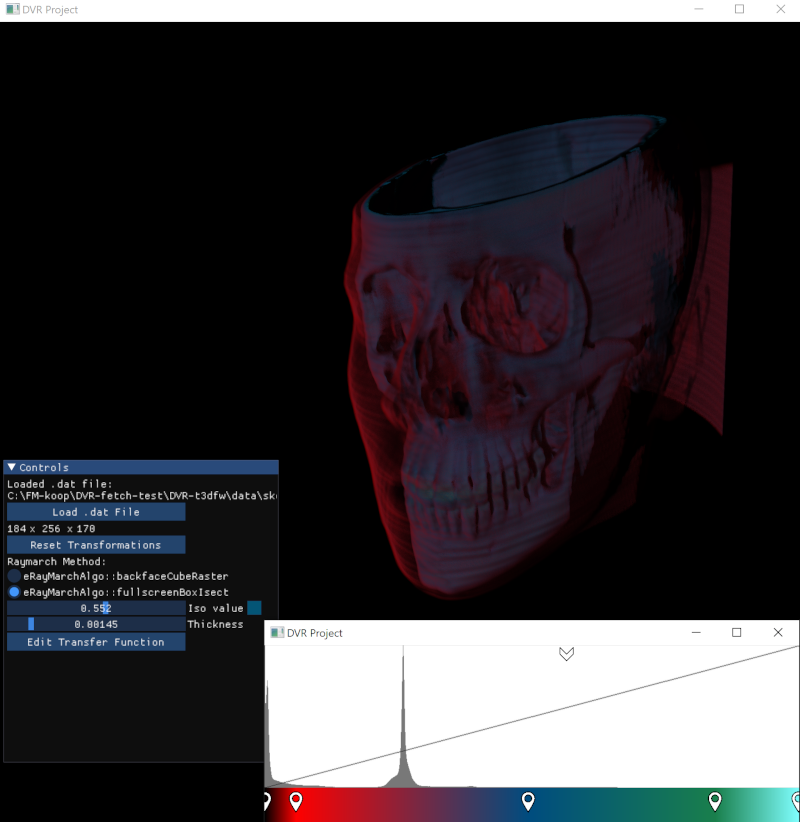

# Direct Volume Rendering

Simple direct-volume rendering application that uses [Tiny 3D Framework](https://github.com/pjhusky/t3dfw). 

# Cloning

	git clone --recurse-submodules https://github.com/pjhusky/DVR-t3dfw.git
	
	
	
# Updating all submodules to latest on origin
	
	git submodule foreach --recursive git pull origin main
	git pull
	
	# create new branch (saving commits made in detached head state)
	git submodule foreach --recursive git branch temp-merge
	
	# checkout main (no commits are lost! -- otherwise commits made in detached head state can be seen with 'git reflog'
	git submodule foreach --recursive git checkout main
	
	# merge commits made locally in detached head state that are now in temp-merge branch back into main
	git submodule foreach --recursive git merge temp-merge
	
	# delete the temp branch after the merge back to main as it is no longer needed
	git submodule foreach --recursive git branch --delete temp-merge

# (OBSOLETE) Updating all submodules to latest on origin
	
all submodules are directly checked out to main
	
	git submodule update --remote --merge

submodules may be in detached head mode afterwards...

	git submodule foreach --recursive git pull origin main
	git submodule foreach --recursive git rebase HEAD main
	git pull
